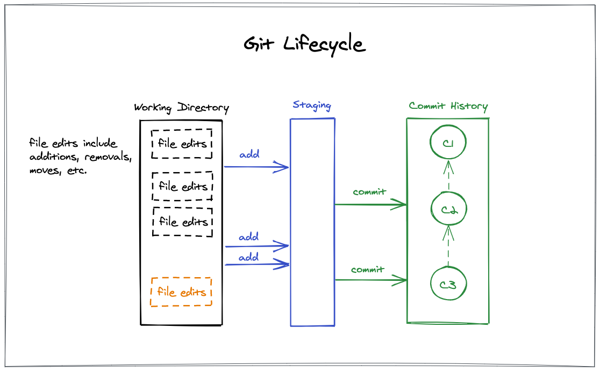

# Getting Started with Git

## Key Concepts Tonight

- Git repository
- Commit
- Commit hash
- Symbolic names (branch names, `HEAD`, tags)
- Working area / staging (index) / repository
- Git != GitHub (or GitLab or BitBucket)

# References

- [Main Git project site][git_scm]
- [Git terms][sw_carpentry_git_terms]
- [Git quick reference][sw_carpentry_git_ref]
- [Git visual guide][git_visual_static]
- [Git visual guide (interactive)][git_visual_dynamic]
- [Git editor configuration][git_editor]
- [Pirates' Git Resources](https://www.pythonpirates.org/resources/#git-and-github)


# Software Carpentry

The materials exercises in this workshop are heavily influenced by those made freely available by the [Software Carpentry group][sw_carpentry].

Our thanks goes out to them for the course materials they produce and the work they do in helping people level up with important tech skills.

- [Version Control with Git][git_exercises] exercises
- [Talk Python #93][podcast] - SW Carpentry is the show topic

# Preparation for Meetup

  1. Install the Git software appropriate for your operating system.
  1. Install a code editor.  
     If you have an editor you already use and like, keep using it.  
     Otherwise, [VS Code][vscode] is a popular option.
  1. Sign up for an account on [GitHub](https://github.com).


## Mac OS X

Install [Homebrew][mac_homebrew].  After you have homebrew installed update to the latest version of Git:

    brew install git

Optional tools:

    brew install tree
    brew install starship

## Linux

Ubuntu/Debian systems:

    sudo apt update
    sudo apt install -y git

See READMEs of tools like `startship` and `bash-git-prompt` for installation help.
- [Starship][starship_prompt]
- [bash-git-prompt][bash_git_prompt]

## Windows

Download and install [Git for Windows][git_windows] (includes Bash).


# BASH Usage

Git BASH and these exercises are unix-centric, which can be unfamiliar to those new to the command line.  No worries, we're here to help.  Please ask questions!

A few commands and directory shortcuts:

    ls               list directory contents
    cd <path>        change directory to <path>
    cd -             takes you back to your previous directory
    mkdir <dir>      make a new directory
    mv <src> <dest>  move/rename a file or directory
    cat <file>       print contents of a file
    less <file>      prints contents of file, one page at a time
                     use 'q' to exit

    Shorthand
    ~                shorthand for home directory (same as $HOME)
    .                the current directory
    ..               the parent directory


### Navigating the Command line:

| Key combination | Effect | 
|---------------|-------------------------|
| UP-ARROW      | edit last command executed |
| CTRL-a        | go to beginning of line |
| CTRL-e        | go to end of line |
| CTRL-w        | delete word *preceding* cursor
| CTRL-u        | delete from cursor to beginning of line |


# Initial Configuration

Check your version of git:

    git --version

Check if you have git configured already:

    git config --list

If not already configured, add your name and email:

    git config --global user.name "Your Name"
    git config --global user.email "you@example.com"

If you want to use **VS Code** as the editor for your commit messages:

    git config --global user.editor "code -n -w"

**Example configurations for other editors can be found [HERE][git_editor].**

Adding a few aliases can reduce some typing:

    git config --global alias.stat status
    git config --global alias.co checkout
    git config --global alias.lol  "log --oneline --graph --decorate"

## Windows

Additional config for Windows users:

    git config --global credential.helper manager

    # Confirm this is still recommended
    git config --global core.autocrlf true

    # Otherwise use standard hands-off policy ('input' for middle ground)
    git config --global core.autocrlf false


# Lesson 1:  Making Commits



Git commands introduced:
- `git status`
- `git init`
- `git add`
- `git diff`
- `git commit`


There are two common ways to set up a git repository (repo) on your local system:
- initialize a new one
- copy one from another location (covered later)

## Follow Along

1. Create a new directory named `git-exercises`
1. Change into this directory  
  `cd git-exercises`
1. Notice that git is not yet tracking this directory:  
   `git status`  
1. Check directory contents:  
   `ls -la`
1. Initialize this as a new repository:  
  `git init`
1. Check the directory contents again:  
  `ls -la`  
  `tree` (optional)
1. Create a new file `hello.py` with some content
1. Check the current status:  
  `git status`
1. Add the recent change using a 2 step process:
    1. Notify git we want to track the changes of this new file:  
  `git add hello.py`
    1. Commit the change using either:  
  `git commit`  
  `git commit -m "log message"`
1. Check the git history:  
  `git log`  
1. Make more changes to `hello.py`
1. Show the current changes using `git diff`:  
  `git diff`
1. Commit the latest change:  
  `git add .`  
  `git commit -m "another change"`
1. Show the updated commit log:  
  `git log`  
  `git log --oneline`


## Excercise 1

1. If you haven't yet done so, create the `git-exercises` directory and initialize as a git repo.
1. Create a file `python.txt` and write a line or two about how you currently use Python.
1. Add and commit that file to git.
1. Create a nested directory within this repo `resources`
    1. Add two files under resources `a.txt` and `b.txt`
    1. Add some random content to each file, whatever you like.
1. Register the *directory* with `git add`:  
  `git add resources`
1. Notice how both files were picked up for add with the next commit:
  `git status`
1. Commit the new files.
1. Verify your commits in the git log.


> Note: The more meaningful your git commit messages the better.  Your future self and others will thank you.  
> See [XKCD](https://xkcd.com/1296/) humor on commit messages.


# Lesson 2: Branching

Git commands introduced:
- `git branch`
- `git checkout`
  - a.k.a. `git switch`
- `git merge`

Branching is where Git starts to shine!  Branches allow you to work on changes in a separate parallel history.  Branches are well suited for working on new application functionality, isolating bug fixes, and just good ole experimentation.

Git provides the means to merge changes from one branch to another.  This is useful for:
- Updating a banch with changes that were made on `master`/`main` since the branch was created
- Merging the branch back to the primary `master`/`main` branches (or others)

It's common to hear git discussions about "Merging a branch to master/main" -- often a feature branch with recent development.

## Follow Along

1. Check what are the current branches of this repo:  
  `git branch`
1. Create a new branch `awesome-poetry`:  
  `git branch awesome-poetry`
1. Notice the new branch is now in the branches list:  
  `git branch`
1. Switch to the new branch using `git checkout BRANCH_NAME`:  
   `git checkout awesome-poetry`
1. Create a new file named `poetry.txt` and add a few memorable lines:  
    One fish  
    Two fish  
    Red fish  
    Blue fish
1. Add and commit the file:  
  `git add .`  
  `git commit -m "added some Seuss"`
1. Check the git log:  
  `git log --oneline --graph --decorate`
1. Switch back to the branch `master`:  
  `git checkout master`
1. `poetry.txt` should be missing
1. Switch back to the branch `awesome-poetry` using either:  
  `git checkout awesome-poetry`  
  `git checkout -`
1. Verify `poetry.txt` is back.

You can switch among branches as much as you like.  The working directory will update to the most recent commit of the branch as long as you don't have any pending uncommitted changes.

Let's merge the branch into `master`.

1. Verify we are on the `master` branch:  
  `git checkout master`
1. Merge the branch `awesome-poetry` into the current branch:  
  `git merge awesome-poetry`
1. Optionally delete the merged branch:  
  `git branch -d awesome-poetry`

We can also review old versions of files using `git checkout`.

1. Make another edit to `poetry.txt`, adding and removing a few lines.
1. Commit the changes.
1. Find a previous git hash as the snapshotted version:  
  `git log --oneline`
1. Roll back to that snapshot:  
  `git checkout HASH poetry.txt`
1. Verify the contents of the file is the older version:  
  `cat poetry.txt`
1. Notice the effect on git status:  
  `git status`
1. See the effect of `restore`:  
  `git restore .`  
  `git status`
1. Revert changes to last commit:  
  `git reset --hard HEAD`

> **CAUTION:** `git reset --hard` is a powerful but potentially destructive action.

## Key Points

- Branches are symbolic names that reference commit hashes.
- As commits are made on a branch, the reference is advanced to the most recent commmit.
- Use `git checkout BRANCH_NAME` to switch the current active branch.
- `HEAD` is a special symbolic name that references the current active branch _or_ commit hash (a.k.a. "detached HEAD" which means not on a branch).
  - `HEAD` changes as you switch branches
  - `HEAD` advances with commits just like branch names
- Previous versions of files can be accessed using `git checkout`.

## Excercise 2

1. Create a new branch `pyrates`.
1. Edit the `hello.py` file and change the greeting to print `Hello, Pyrates!`
1. Add another file `more-poetry.txt` and add a few lines to the file (your choice).
1. Commit the changes to this branch.
1. Merge the changes from the `pyrates` branch back to `master`.
1. Verify your commits show in the git log.


# Lesson 3: Ignoring Files

Git feature and website introduced:
- `.gitignore`
- https://gitignore.io 

Sometimes you have files you don't want to be tracked by Git.  Cache files, secret keys, and Python virtual environments are examples.

Git provides a mechanism for ignoring files and directories based on a file matching pattern.   The patterns are stored in a file named `.gitignore`.  This file can be at the root of the repo in which case it applies to the entire repo, or placed in individual directories for more targetted effect.

Let's set up a basic Python virtual environment to illustrate.

## Follow Along

1. Create a python virtual environment:  
  `python3 -m venv venv`
1. Notice git lists `venv` as an untracked directory:  
  `git status`
1. Go to the website https://gitignore.io and enter paramenters for the ignore
    - Python
    - vscode
    - PyCharm
1. Copy the contents to `.gitignore`
1. Notice the difference in what `git status` now reports.
1. Add and commit the `.gitignore` file.


# Lesson 4: GitHub Set Up

Git commands introduced:
- `git clone`
- `git pull`
  - `git fetch`
  - `git merge`
- `git push`

## Mac and Linux

Check if you already have an SSH key pair:

    ls -la ~/.ssh

    id_ed25519
    id_ed25519.pub
    id_rsa
    id_rsa.pub

If not, create them using `ssh-keygen`:

    ssh-keygen -t ed25519 -f ~/.ssh/id_ed25519 -C "EMAIL_USED_WITH_GITHUB"

Note: Your email will be recorded with each commit available on GitHub.  You may not want your email to be public.  The GitHub *setting* links to information about using a private email address [HERE][github_private_email].

Copy the *public* key (with `.pub` extension) to your clipboard:

    # if you already have id_rsa.pub use that instead
    pbcopy < ~/.ssh/id_ed25519.pub

    # on linux use 'xsel -i' instead of 'pbcopy'

Add this public key to GitHub: **Settings > SSH and GPG keys**


## Windows

Make sure you configured:  
`git config --global credential.helper manager`

Create a Personal Access Token (PAT) using the GitHub website.  
**Settings > Developer settings > Personal access tokens**

> *KEEP THIS BROWSER TAB OPEN!*


## Follow Along - Part 1

1. Log into GitHub in your browser
1. In the top right corner you'll find a `+` with a menu
1. Select `New repository`
1. Give the repository a name and description
1. Select options for README, .gitignore, and License
1. Click `Create repository`
1. On the new screen, click the *green button* `Code`
    - Mac/Linux: use the **SSH** URL
    - Windows: use the **HTTPS** URL
1. Clone the repo to your local machine:

    git clone REPO_URL

1. Inspect the "remote" information configured for this repo:  
  `git remote --verbose`
1. Inspect the extra branch information available:  
  `git branch --all`
1. Make some edits to the repo and commit your changes.
1. Push your changes back to GitHub:  
  `git push origin HEAD`
1. (Windows) When prompted for credentials enter:
    - Your github username
    - Your new **Personal Access Token** for the password

## Follow Along - Part 2

1. Fork [this repo][sample_repo] so you have a copy under your own account.

2. Clone the repo to your local machine.
    - Mac/Linux: use the **SSH** URL
    - Windows: use the **HTTPS** URL

    git clone REPO_URL

3. Add another *remote* to the repo named `upstream`:

    git add remote upstream https://github.com/PDXPythonPirates/meetup-workshops.git

4. Make sure you have the latest `main`/`master`:  
  Note: `git pull` is two commands in one: `git fetch` and `git merge`

    git checkout main  
    git pull upstream main  

5. Check out a new branch to make changes:  

    git checkout -b fix-typos

6. Make edits and commit to your branch.
7. Push the changes in your branch to **_your fork_**:  
  Use `HEAD` as a shorthand for the current branch  

    git push origin HEAD

8. You can open a *Pull Request* from your **fork** in GitHub.


# Additional Topics to Research

- `git rebase`
- `git reflog`
- `git bisect`

# Misc.

### Starship configuration

Add the following to your `~/.bashrc`

```bash
# delegate to starship for bash prompt config
#   https://github.com/starship/starship
if [[ -n "$(command -v starship)" ]]; then
  eval "$(starship init bash)"
  eval "$(starship completions bash)"
else
  echo "Unable to configure prompt, 'starship' not found."
fi
```


[git_scm]: https://git-scm.com/
[git_visual_static]: https://marklodato.github.io/visual-git-guide/index-en.html
[git_visual_dynamic]: http://onlywei.github.io/explain-git-with-d3/
[sw_carpentry]: https://software-carpentry.org/
[git_exercises]: http://swcarpentry.github.io/git-novice/ 
[sw_carpentry_git_ref]: http://swcarpentry.github.io/git-novice/reference 
[sw_carpentry_git_terms]: http://swcarpentry.github.io/git-novice/reference#commit
[podcast]: https://talkpython.fm/episodes/show/93/spreading-python-through-the-sciences-with-software-carpentry
[vscode]: https://code.visualstudio.com/
[git_editor]: http://swcarpentry.github.io/git-novice/02-setup/index.html
[git_windows]: https://gitforwindows.org/
[mac_homebrew]: https://brew.sh/
[sample_repo]: https://github.com/PDXPythonPirates/meetup-workshops
[git_bash_contrib]: https://github.com/git/git/tree/master/contrib/completion
[starship_prompt]: https://github.com/starship/starship
[bash_git_prompt]: https://github.com/magicmonty/bash-git-prompt
[github_private_email]: https://github.com/settings/emails
